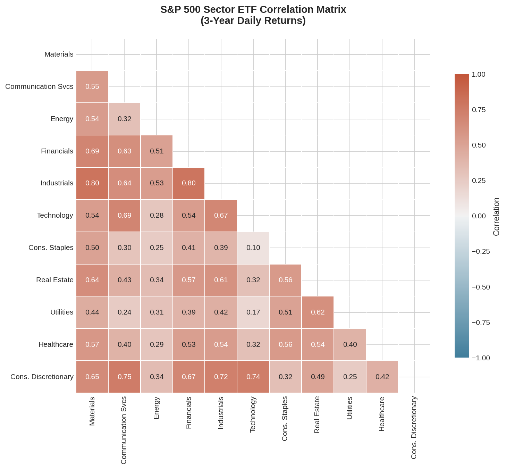
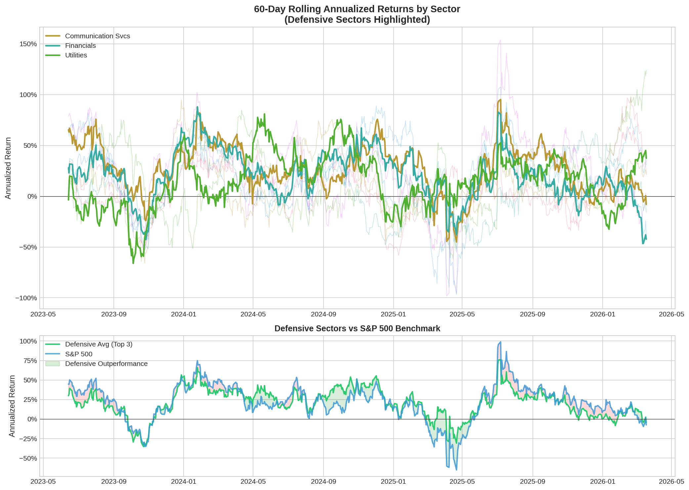
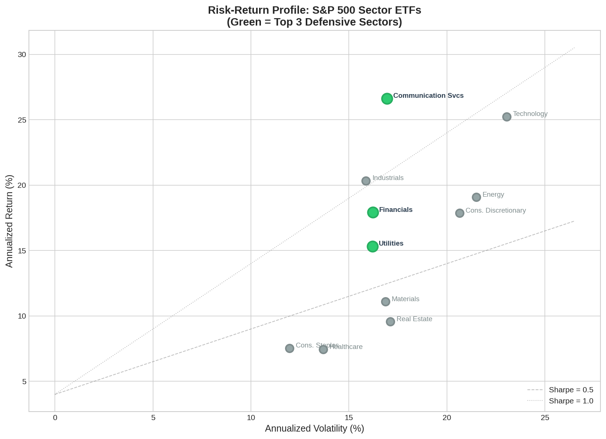
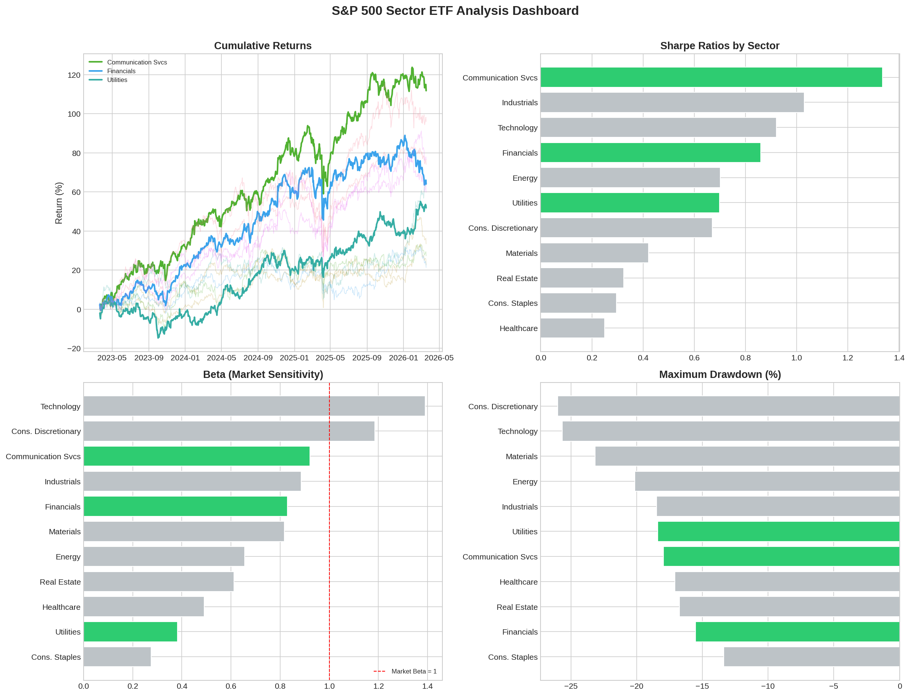

# S&P 500 Sector ETF Analysis: Identifying Defensive Sectors

> Analyzed 3 years of S&P 500 sector ETF data using SQL and Python; created correlation heatmaps and rolling return charts, identifying 3 defensive sectors with superior risk-adjusted returns.

## Key Findings

| Metric | Communication Svcs | Financials | Utilities |
|---|---|---|---|
| Annualized Return | 26.63% | 17.93% | 15.33% |
| Annualized Volatility | 16.95% | 16.22% | 16.20% |
| Sharpe Ratio | 1.335 | 0.859 | 0.699 |
| Beta | 0.92 | 0.83 | 0.38 |
| Max Drawdown | -17.97% | -15.54% | -18.39% |

**Defensive sectors were identified using a composite score** weighted across Sharpe Ratio (40%), Beta (30%), and Max Drawdown (30%).

## Visualizations

### Correlation Heatmap


### Rolling Returns (Defensive Sectors Highlighted)


### Risk-Return Scatter Plot


### Summary Dashboard


## Project Structure

```
├── scripts/
│   └── sp500_sector_analysis.py   # Main analysis pipeline
├── sql/
│   ├── 01_sector_risk_ranking.sql       # Rank sectors by Sharpe, Beta, Drawdown
│   ├── 02_monthly_sector_returns.sql    # Monthly aggregated returns
│   ├── 03_downside_correlation.sql      # Joint negative day analysis
│   ├── 04_defensive_vs_benchmark.sql    # Defensive portfolio vs S&P 500
│   └── 05_volatility_regime.sql         # Sector behavior across vol regimes
├── data/
│   ├── sector_prices.csv          # Raw daily closing prices
│   ├── daily_returns.csv          # Computed daily returns
│   ├── sector_summary.csv         # Risk metrics summary table
│   └── sector_analysis.db         # SQLite database for SQL analysis
├── output/
│   ├── correlation_heatmap.png
│   ├── rolling_returns.png
│   ├── risk_return_scatter.png
│   └── sector_dashboard.png
├── requirements.txt
└── README.md
```

## Methodology

### Data
- **Source:** Yahoo Finance via `yfinance` API
- **Period:** 3 years of daily closing prices (2023–2026)
- **Universe:** 11 SPDR S&P 500 Sector ETFs + SPY benchmark

### Metrics Computed
| Metric | Description |
|---|---|
| Annualized Return | Mean daily return × 252 |
| Annualized Volatility | Std of daily returns × √252 |
| Sharpe Ratio | (Return - Rf) / Volatility |
| Sortino Ratio | (Return - Rf) / Downside Deviation |
| Max Drawdown | Largest peak-to-trough decline |
| Calmar Ratio | Annual Return / |Max Drawdown| |
| Beta | Cov(Ri, Rm) / Var(Rm) |
| Alpha | Ri - [Rf + β(Rm - Rf)] |

### Defensive Sector Selection
A composite **Defensive Score** was calculated by normalizing and weighting:
- **Sharpe Ratio** (40%) — risk-adjusted return quality
- **Beta** (30%, inverted) — lower market sensitivity preferred
- **Max Drawdown** (30%, inverted) — shallower drawdowns preferred

## SQL Highlights

The project includes 5 analytical SQL queries demonstrating:
- Window functions (`RANK() OVER`, rolling calculations)
- CTEs (Common Table Expressions) for readability
- Self-joins for pair-wise correlation analysis
- Conditional aggregation with `CASE WHEN`
- Volatility regime classification

## Tech Stack

- **Python 3.12** — pandas, numpy, matplotlib, seaborn, yfinance
- **SQL** — SQLite for analytical queries
- **Data Viz** — matplotlib + seaborn (publication-quality charts)

## How to Run

```bash
pip install -r requirements.txt
python scripts/sp500_sector_analysis.py
```

## License

This project is for portfolio/educational purposes.
